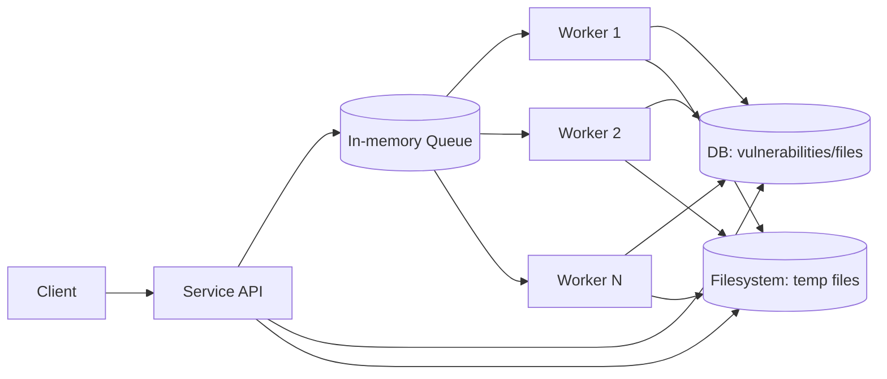
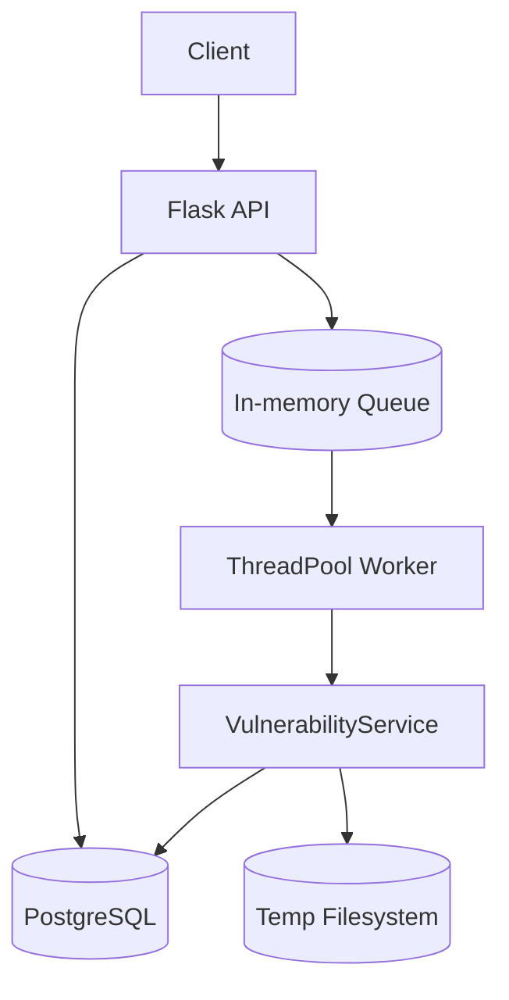
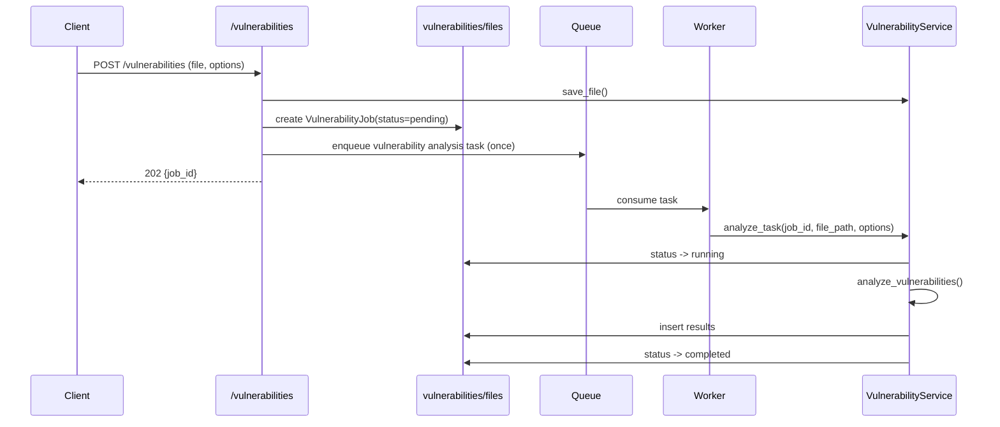

# Vulnerability Monitor Service

## Operating Model

서비스는 요청을 받아 DB에 작업 상태를 저장하고, 취약점 분석 작업을 인메모리 큐에 등록합니다.
워커들은 큐에서 작업을 병렬로 소비하며, 결과를 DB에 기록하고 임시 파일 시스템을 사용합니다.

## Architecture

### 주요 포인트

- 큐는 백그라운드 작업 트리거로 사용됩니다.
- 취약점 분석 작업은 한 번 큐에 등록되며, 하나의 워커 플로우에서 전체 처리가 이루어집니다.
- 분석 로직은 `VulnerabilityService`에 집중되어 있습니다.

## Vulnerability Analysis Request Flow

### 분석 동작

- 재귀적 재등록 없이 한 번의 워커 작업에서 전체 분석이 수행됩니다.
- 작업 상태는 `pending -> running -> completed`(또는 `failed`)로 갱신됩니다.

## Test & Development

- 테스트는 `tests/` 디렉토리의 pytest 기반 테스트로 수행합니다.
- 개발 환경은 requirements.txt 및 Dockerfile을 참고하세요.

## Directory Structure

- `app/` : 서비스 구현 코드
- `tests/` : 테스트 코드
- `migrations_alembic/` : DB 마이그레이션
- `instance/` : 인스턴스별 설정/데이터

---

자세한 API 및 사용법은 코드와 주석을 참고하세요.
