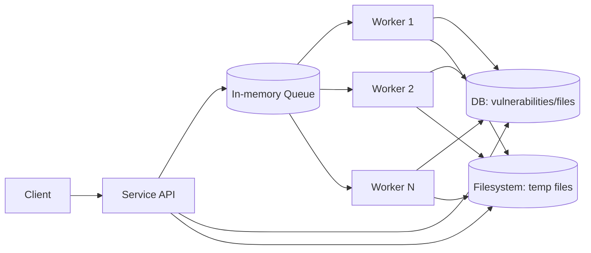
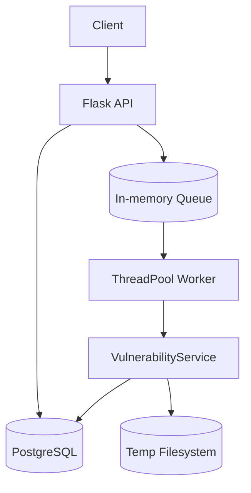
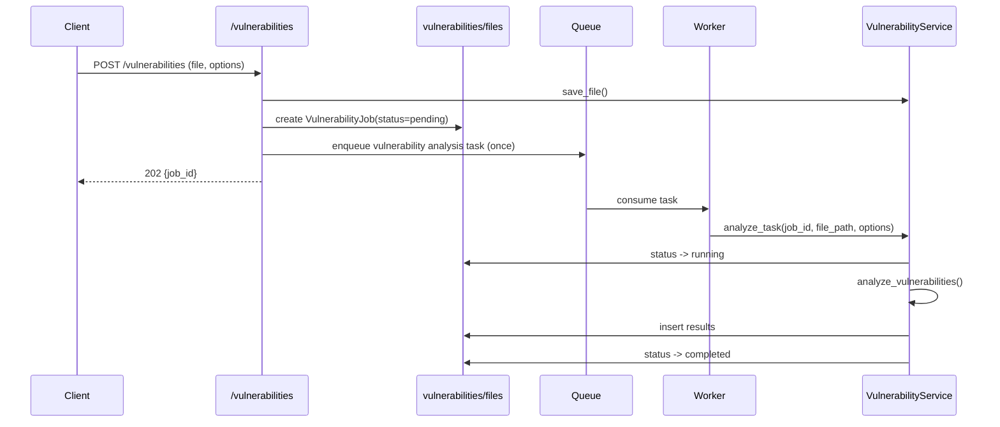

# Vulnerability Monitor Service

## Operating Model

The service receives requests, stores job state in the database, and enqueues vulnerability analysis jobs in an in-memory queue.
Workers consume tasks concurrently from the queue, write results to the database, and use the temporary filesystem.

## Architecture

### Key Points

- The queue is used as a trigger for background jobs.
- Each vulnerability analysis job is enqueued once and fully processed in a single worker flow.
- The analysis logic is centralized in `VulnerabilityService`.

## Vulnerability Analysis Request Flow

## Test & Development

- Tests are implemented using pytest in the `tests/` directory.
- For development environment setup, refer to requirements.txt and Dockerfile.

---

For detailed API usage, refer to the code and comments.
