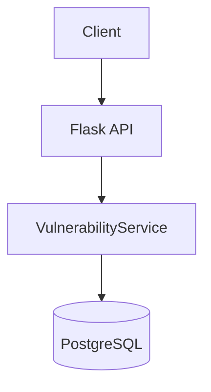
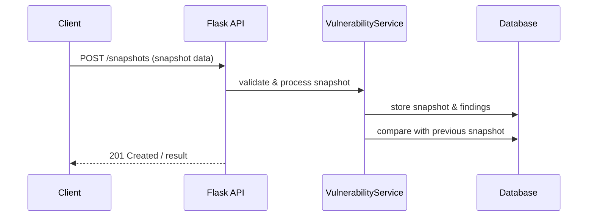

# Vulnerability Monitor Service

## Architecture

The service receives HTTP requests (mainly vulnerability snapshot submissions and queries) via a Flask API. All validation, comparison, and database operations are handled synchronously in the API and service layer.

### Key Points

- All logic is handled synchronously in the Flask API and service layer.
- No background queue, thread pool, or worker process is used.
- The `VulnerabilityService` handles validation, deduplication, snapshot comparison, and DB writes.

## Vulnerability Snapshot Submission Flow

### Flow Details

- Client submits a vulnerability snapshot via HTTP POST.
- API validates input and checks for duplicates.
- Service compares with the previous snapshot for the same product/version/source.
- New snapshot and findings are stored in the database.
- Change summary is calculated and stored.

## Test & Development

- Tests are implemented using pytest in the `tests/` directory.
- For development environment setup, refer to requirements.txt and Dockerfile.

---

For detailed API usage, refer to the code and comments.
